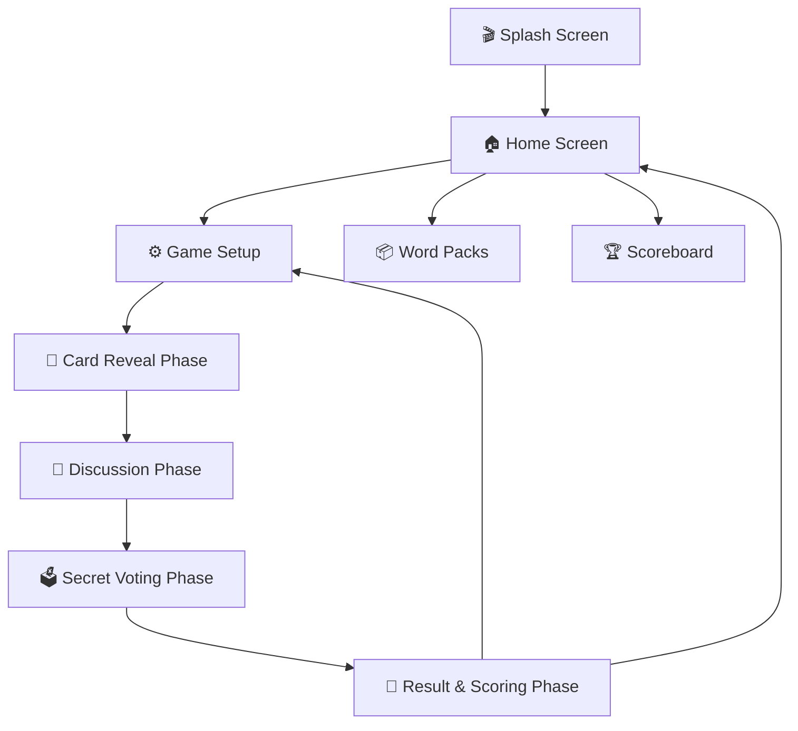

# 🎭 Imposter Party - Android Social Deduction Game

<p align="center">
  
</p>

<p align="center">
  <b>A pass-and-play social deduction party game built with Kotlin, Jetpack Compose, and Material 3.</b><br>
  Find the imposter among your friends before they blend in!
</p>

<p align="center">
  
  
  
  
  
</p>

---

## 📖 About the Game

**Imposter Party** is an offline, pass-and-play multiplayer social deduction game. One device is passed around the group:
- **Civilians** receive the exact **Secret Word**.
- **Imposters** receive only a general **Category Clue** and do not know the actual secret word.
- Players take turns giving subtle one-word or short clues without giving the secret away to the imposter.
- The group discusses, spots inconsistencies, and votes to uncover the imposter!

---

## ✨ Features & Highlights

### 🎭 Secret Roles & Pass-and-Play Reveal
- **Lobby Seating Order**: Pass the phone sequentially in the exact order players are seated in the lobby (`Player 1`, `Player 2`, `Player 3`, ...).
- **Flip Card Animation**: Smooth 3D card flipping with privacy-protecting dark backsides and distinctive glowing borders (red accent for imposters, turquoise for civilians).
- **One-Time Reveal Gate**: The "Next Player" button is safely hidden until the current player has flipped and viewed their card.

### 💬 Streamlined Discussion Phase
- **Random Starting Speaker**: Clearly highlights one randomly chosen player to kick off the conversation with the first statement/clue.
- **Scrollable Interface**: Perfectly responsive across all screen sizes with the **"Vote Now"** button permanently pinned to the bottom.
- **Flexible Timing**: Choose between timed discussion (30s, 60s, 90s, 120s, or Custom) with circular countdown visualization, or **Untimed Free Discussion**.

### 🗳️ Secret Voting & Real-Time Tallying
- **Private Ballot**: Pass the phone around for each player to secretly cast their vote.
- **Instant Tallying & Dramatic Result**: Reveals the accused player, unmasks all imposters, and reveals the secret word with particle animations and sound/haptic cues.

### 📦 Built-In & Custom Word Packs
- **Preloaded Categories**: Includes comprehensive built-in packs for **Animals & Nature**, **Food & Drinks**, **Movies & TV**, **Tech & Gadgets**, and **Places & Landmarks**.
- **Generalised Clues**: Built-in clue words are crafted to prevent imposters from instantly guessing the secret word.
- **Custom Word Pack Creator**: Create custom decks with unlimited words. If a clue is left empty, the pack title is automatically used as the default clue.
- **Multi-Pack Selection**: Choose multiple categories to be mixed during gameplay directly from the Word Packs screen or Setup Lobby.

### 📊 Dense Scoreboard & Relative Ranking
- **Player Name Merging**: Case-insensitive and whitespace-tolerant score merging across all played rounds.
- **Ties & Relative Places**: Players tied with equal points, round counts, and win rates share the same rank (**🥇 1st place**, **🥈 2nd place**, **🥉 3rd place**).
- **Game-Wise Match History**: View detailed histories of past matches and resume previous game sessions with preserved scores.
- **Individual Deletion**: Easily delete specific player records or single match histories.

### ⚡ Mid-Game Background Persistence
- **Crash & Interruption Recovery**: If the app is closed or switched away in the middle of a game (`Card Reveal`, `Discussion`, or `Voting`), reopening the app presents a prominent **"⚡ Resume Active Game"** button to jump straight back into the action.

### 🎨 Modern Dark Neon Theme & Portrait Lock
- **Visual Design**: Sleek dark backgrounds with vibrant crimson, turquoise, and gold accents.
- **Custom App Logo & Animated Splash Screen**: Custom hooded visor silhouette with breathing glow animations.
- **Portrait Locked**: Locked strictly to portrait mode for convenient one-handed party handling.

---

## 📱 Game Loop & Screen Flow



---

## 🛠️ Tech Stack & Architecture

| Layer | Technology |
|---|---|
| **Language** | [Kotlin](https://kotlinlang.org/) (100%) |
| **UI Framework** | [Jetpack Compose](https://developer.android.com/jetpack/compose) with [Material 3](https://developer.android.com/develop/ui/compose/designsystems/material3) |
| **Navigation** | [Navigation3](https://developer.android.com/guide/navigation) (Type-Safe `@Serializable` NavKeys) |
| **Architecture** | MVVM with `StateFlow`, `collectAsStateWithLifecycle`, Coroutines |
| **Persistence** | Local JSON File Storage (`gson`) in Android internal files directory |
| **Build System** | Gradle 8.11 with Kotlin 2.0.21 |
| **Testing** | JUnit 4 (Game logic, clamping, role distribution, scoring, ranking) |

---

## 🚀 Getting Started

### Prerequisites
- **Android Studio**: Ladybug (2024.2.1) or newer
- **JDK**: Version 17 or higher
- **Android SDK**: Min SDK 24 (Android 7.0), Target SDK 35 (Android 15)

### Build & Run Locally
1. **Clone the Repository**:
   ```bash
   git clone https://github.com/DanushBalajiSP/Imposter.git
   cd Imposter
   ```

2. **Run Unit Tests**:
   ```bash
   ./gradlew test
   ```

3. **Build Debug APK**:
   ```bash
   ./gradlew assembleDebug
   ```
   The APK will be generated at `app/build/outputs/apk/debug/app-debug.apk`.

4. **Install on Device via ADB**:
   ```bash
   adb install -r app/build/outputs/apk/debug/app-debug.apk
   ```

---

## 🧪 Testing

Automated test suites cover:
- Manual and automatic imposter count clamping logic.
- Card reveal lobby order preservation.
- Single starting speaker selection within player bounds.
- Scoring rules for civilians vs imposters.
- Case-insensitive scoreboard player name merging.
- Dense leaderboard ranking with ties sharing relative medal places.

Run all tests:
```bash
./gradlew testDebugUnitTest
```

---

## 📄 License

This project is created by **[DanushBalajiSP](https://github.com/DanushBalajiSP)**. Open-source under the MIT License.